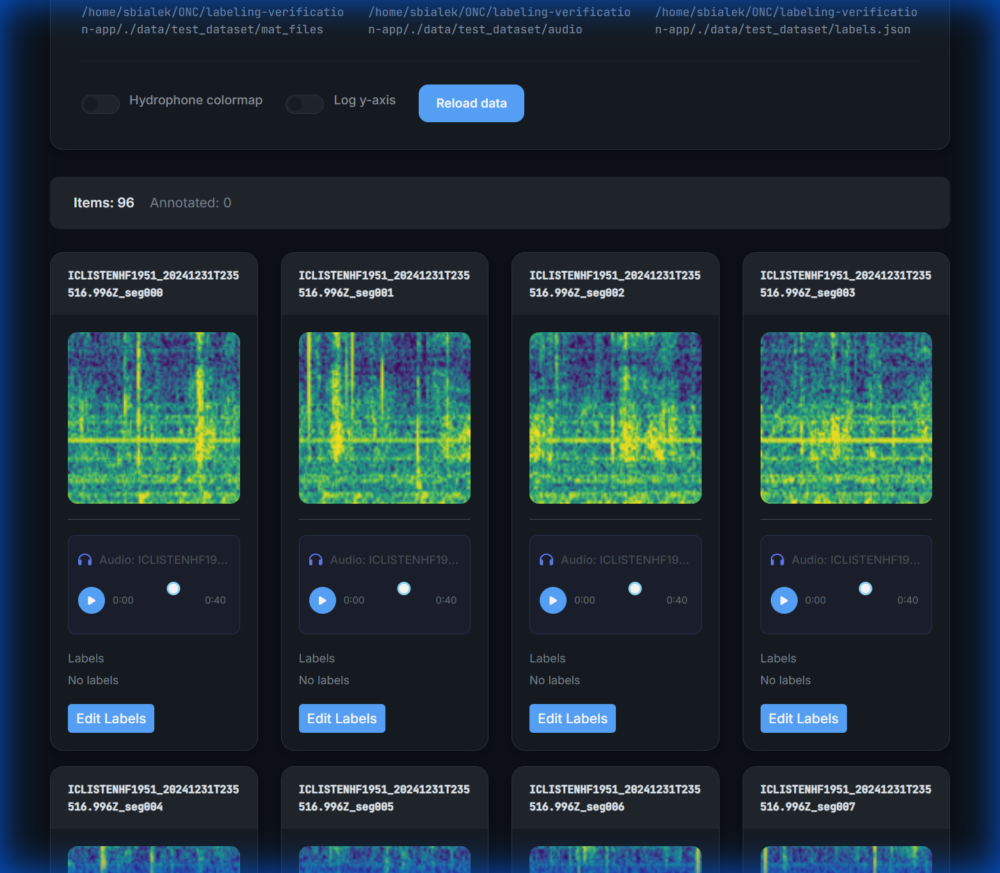

# Hydrophone Acoustic Review Suite: Unified Labeling & Verification Tool

A professional, high-performance web application built with Plotly Dash for the scientific analysis, labeling, and verification of hydrophone data. This tool is specifically designed to handle large-scale acoustic datasets, particularly for marine mammal research (e.g., fin whale calls).

<div align="center">
  
  <p><em>Interactive Spectrogram Verification Interface</em></p>
</div>

## ✨ Key Features

*   **Unified Research Workflow**: Seamlessly switch between **Labeling**, **Verification**, and **Exploration** modes.
*   **Interactive Spectrogram Analysis**: High-resolution Plotly zoom modals with live controls for colormap and frequency scale (Hz/kHz, Linear/Log).
*   **Integrated Audio-Visual Review**: Synchronized audio playback (`.wav`/`.flac`) with custom controllers on both thumbnail and detail views.
*   **Intelligent Data Rendering**: Automatic support for multiple MAT formats, Julian date conversion, and adaptive percentile-based color scaling.
*   **Modern Scientific UI**: Clean, GitHub-inspired dark/light theme optimized for precision research sessions.

## 🚀 Quick Start

### 1. Installation

Ensure you have Python 3.9+ and a virtual environment set up:

```bash
# Clone the repository
git clone https://github.com/Spiffical/labeling-verification-app.git
cd labeling-verification-app

# Create and activate virtual environment
python -m venv .venv
source .venv/bin/activate

# Install dependencies
pip install -r requirements.txt
```

### 2. Running the App

The app can be launched with or without custom parameters. By default, it loads settings from `config/default.yaml`.

```bash
# Start with default configuration (loads config/default.yaml)
python run.py

# Override with a specific configuration file
python run.py --config config/my_research_setup.yaml

# Start directly pointing to a data directory (CLI override)
python run.py --data-dir /path/to/my/hydrophone/data
```

**Configuration Priority:**
1.  **CLI Arguments**: Explicit flags like `--data-dir` or `--port` take top priority.
2.  **Config File**: Settings defined in the specified `--config` file (defaults to `config/default.yaml`).
3.  **Environment Variables**: `DATA_DIR` or `PORT` environment variables.
4.  **Browse Mode**: If no data source is specified, the app starts in **Browse Mode** via the header.

### 3. Loading Data

**No configuration file is strictly required!** You can easily select your data directly through the interactive UI:

1.  **Open the Browser**: Click the **Browse** button in the header.
2.  **Locate Data**: Select your root data directory (Supports Hierarchical `Date/Device` structures).
3.  **Select Date & Device**: Use the dropdowns to filter (or select **All Devices**).
4.  **Load**: Click **Load Data** to populate the workspace.
5.  **Smart Discovery**: The app automatically detects spectrograms, audio, and predictions files. If your structure is unique, use the **Folder Browser** icon to manually map specific paths.


## 📚 Data Organization & Usage

The app supports:
*   **Hierarchical** (Date/Device), **Device-Only**, and **Flat** folder structures
*   **Configurable folder names** (e.g., `spectrograms/`, `mat_files/`, `audio/`)
*   **.mat**, **.npy**, **.png** spectrograms and **.wav**, **.flac**, **.mp3** audio
*   **Cascading Prediction Discovery**: Place a single `predictions.json` or `labels.json` at the root folder to apply to all data, or per-date/per-device for granular control.
*   **Cross-platform browsing**: Navigate to `/mnt` (WSL), `/Volumes` (macOS), or any mounted drives

👉 **[Read the Full Application Usage Guide](docs/APP_USAGE_GUIDE.md)** for detailed instructions.

## 🛠 Project Structure

*   `app/`: Core application logic.
    *   `callbacks/`: Dash callback functions.
    *   `components/`: Reusable UI components (Audio players, Modals, Cards).
    *   `utils/`: Data processing, image rendering, and file I/O utilities.
*   `assets/`: Custom CSS and clientside JavaScript.
*   `config/`: YAML configuration files.
*   `scripts/`: Utility scripts for data management and testing.
*   `taxonomy/`: Hierarchical label definitions.

## 📊 Model Predictions Format

This app consumes model predictions in a **standardized JSON format** (v2.0) that supports:
- Raw model scores (not thresholded)
- Hierarchical taxonomic labels
- Multi-round expert verification
- Full model provenance tracking (SHA256 hash of weights)

**📖 Full Specification**: See [`docs/predictions_json_format.md`](docs/predictions_json_format.md)

### Quick Example

```json
{
  "version": "2.0",
  "model": {
    "model_id": "sha256-abc123",
    "architecture": "resnet18",
    "output_classes": ["Biophony > Marine mammal > Cetacean > Baleen whale > Fin whale"]
  },
  "task_type": "whale_detection",
  "items": [
    {
      "item_id": "seg_000",
      "model_outputs": [
        {
          "class_hierarchy": "Biophony > Marine mammal > Cetacean > Baleen whale > Fin whale",
          "score": 0.87
        }
      ],
      "verifications": []
    }
  ]
}
```

**For integration instructions**, see:
- [`docs/integration_guide.md`](docs/integration_guide.md) - How to update your inference pipelines
- [`shared/unified_prediction_tracker.py`](shared/unified_prediction_tracker.py) - Python class for generating predictions


## 🧪 Testing

Run the test suite to ensure everything is working correctly:

```bash
pytest
```

## 📄 License

This project is licensed under the MIT License - see the [LICENSE](LICENSE) file for details.

## 🤝 Contributing

Contributions are welcome! Please feel free to submit a Pull Request.
