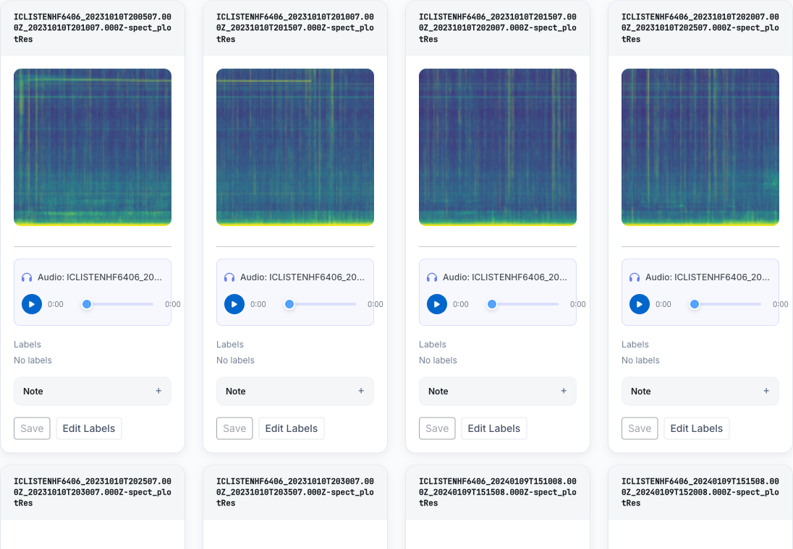
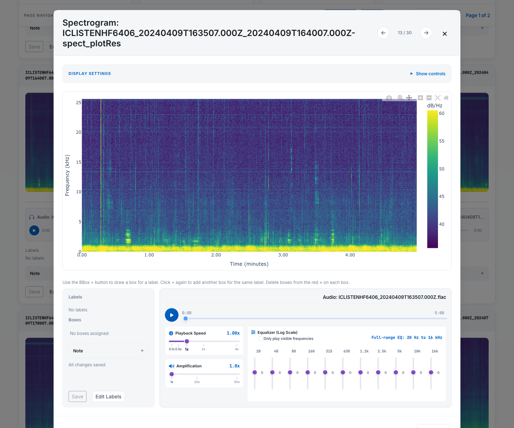

# Hydrophone Acoustic Review Suite

Dash app for labeling, verifying, and exploring hydrophone detections with spectrograms, audio playback, notes, and time-frequency bounding boxes.

<table>
  <tr>
    <td align="center" valign="top" width="50%">
      <strong>Main app page</strong><br>
      
    </td>
    <td align="center" valign="top" width="50%">
      <strong>Spectrogram review modal</strong><br>
      
    </td>
  </tr>
</table>

## Install

```bash
git clone https://github.com/Spiffical/hydrophone-labeling-verification-app.git
cd hydrophone-labeling-verification-app

python3 -m venv .venv
source .venv/bin/activate
pip install -r requirements.txt
pip install -e .
```

The base install includes support for existing spectrogram files and on-the-fly generation from audio.

## Start

Use `python3 run.py` from the repository, or `hydrophone-verify` after editable install.

```bash
# Start in browse mode and choose folders in the app
python3 run.py

# Start from a folder of audio files and generate spectrograms
python3 run.py --mode label --data-dir /path/to/audio \
  --spectrogram-source audio_generated \
  --fft-window-sec 1.0 --fft-overlap 0.9 \
  --freq-min-hz 5 --freq-max-hz 100

# Same workflow through the installed CLI
hydrophone-verify --mode label --data-dir /path/to/audio \
  --spectrogram-source audio_generated \
  --fft-window-sec 1.0 --fft-overlap 0.9 \
  --freq-min-hz 5 --freq-max-hz 100

# Verification with predictions
python3 run.py --mode verify --data-dir /path/to/data-root \
  --predictions-json /path/to/predictions.json
```

Useful startup flags:

| Flag | Purpose |
| --- | --- |
| `--data-dir` | Root folder to load at startup. Can be flat, device-only, or `DATE/DEVICE`. |
| `--audio-folder` | Audio folder override when audio is separate from `--data-dir`. |
| `--label-folder`, `--spectrogram-folder` | Existing MAT/NPY/image spectrogram folder. `run.py` uses `--label-folder`; installed CLI also supports `--spectrogram-folder`. |
| `--spectrogram-source` | `existing` or `audio_generated`. |
| `--fft-window-sec` | FFT window duration in seconds for generated spectrograms. |
| `--fft-overlap` | FFT overlap ratio, `0` to `0.99`. |
| `--freq-min-hz`, `--freq-max-hz` | Frequency limits for generated spectrograms. |
| `--port`, `--host` | Server binding. |

The same spectrogram settings are also available from the gear icon in the app and in `config/default.yaml`.

## Data

Supported spectrogram files: `.mat`, `.npy`, `.png`, `.jpg`, `.jpeg`.

Supported audio files: `.wav`, `.flac`, `.mp3`, `.ogg`.

Supported layouts:

```text
flat-folder/
  clip_001.wav
  clip_002.wav
  labels.json

data-root/
  2026-01-07/
    ICLISTENHF0001/
      spectrograms/ or mat_files/
      audio/
      predictions.json or labels.json
```

If no data path is supplied, click **Browse**, choose the root folder, review detected spectrogram/audio/prediction paths, then click **Load Data**.

## Labeling And Verification

Set your name and email from the top-right profile button before editing.

Open a spectrogram card to review the detail modal. Use label rows to accept, reject, add, delete, or edit labels depending on the active mode. Save/confirm changes before leaving a reviewed item.

## Bounding Boxes

Bounding boxes store `time_start_sec`, `time_end_sec`, `freq_min_hz`, and `freq_max_hz` with the selected label.

In the spectrogram modal:

- Click the **+** button beside a label to start drawing a box for that label.
- Drag on the spectrogram to create the time-frequency box.
- Click **+** again to add another box for the same label.
- Use the box list to assign a tag or open the box editor.
- Use the editor to adjust label, tag, time limits, or frequency limits.
- Delete boxes with the red `x` shown on the box.

## Audio Controls

Cards include play/pause and seek controls when matching audio is found. The detail modal adds playback speed, amplification, an EQ, and **Only play visible frequencies**, which filters playback to the current spectrogram frequency window.

Use `--audio-transport mp3_cached` only if browser seeking is unreliable with original audio files.

## Prediction Format

Predictions and saved labels use the unified JSON format. See:

- [`docs/predictions_json_format.md`](docs/predictions_json_format.md)
- [`docs/integration_guide.md`](docs/integration_guide.md)
- [`shared/unified_prediction_tracker.py`](shared/unified_prediction_tracker.py)

## Test

```bash
pytest
```
